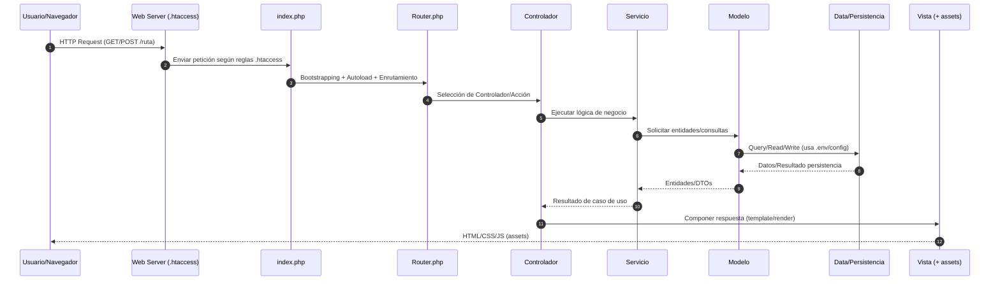

# Arquitectura MVC — Proyecto `parroquiaPOO`

Este documento resume la arquitectura del proyecto en términos de capas **MVC**, archivos de entrada y componentes de soporte (autoload, configuración, pruebas y seguridad). Incluye dos diagramas **Mermaid** (componentes y secuencia) y un checklist de mejoras recomendado.

---

## 1) Diagrama de componentes (MVC + capas de soporte)

```mermaid
flowchart LR
    subgraph Entry["Capa de Entrada"]
        IDX[index.php]
        RTR[Router.php]
        AUTO[autoload.php]
        CFG[config.php]
        HTA[.htaccess(.production)]
    end

    subgraph Controller["Controlador"]
        CTRL[Controlador/*]
    end

    subgraph Service["Servicios"]
        SRV[Servicios/*]
        HLP[helpers.php]
    end

    subgraph Model["Modelo"]
        MOD[Modelo/*]
    end

    subgraph DataLayer["Data / Persistencia"]
        DAT[Data/*]
        LOGS[Logs/*]
        ENV[.env / .env.production / .env.example]
    end

    subgraph View["Vista"]
        VST[Vista/*]
        ASSETS[assets/*]
    end

    subgraph Test["Pruebas & Calidad"]
        TST[tests/* + codeception.yml]
        PHPSTAN[phpstan.neon]
        COMPOSER[composer.json / composer.lock]
        VSC[.vscode]
        DOCS[docs/*]
        README[README.md]
    end

    %% Flujo principal
    IDX --> AUTO
    AUTO --> RTR
    RTR --> CTRL
    CTRL --> SRV
    SRV --> MOD
    MOD --> DAT
    DAT --> LOGS
    CTRL --> VST
    VST --> ASSETS

    %% Config y entorno
    AUTO --> COMPOSER
    CFG --> CTRL
    ENV --> DAT
    HTA --> IDX

    %% Calidad y pruebas
    CTRL --> PHPSTAN
    SRV --> PHPSTAN
    MOD --> PHPSTAN
    TST --> CTRL
    TST --> SRV
    TST --> MOD
    DOCS --> README
```

---

## 2) Diagrama de secuencia (ciclo de una petición típica)



---

## 3) Notas de implementación

- **Enrutamiento**: `index.php` y `Router.php` deben ser la única vía de entrada. Asegura que las rutas directas a `Vista/*` y `Data/*` estén bloqueadas por `.htaccess`.
- **Autoloading**: verifica `autoload.php` y configuración de `composer.json` para PSR-4 y evitar `require` manuales.
- **Servicios vs. Controladores**: Mantén los controladores delgados; la lógica de negocio vive en `Servicios/*`. Los servicios deberían ser reutilizables y fácilmente testeables.
- **Modelos**: Los modelos no deben renderizar vistas; limítalos a entidades y coordinación con la capa `Data/*`.
- **Configuración y secretos**: Nunca comprometas `.env` con secretos. Usa `.env.example` como plantilla y añade `.env` al `.gitignore`.

---

## 4) Checklist de mejora recomendada

1. **Seguridad**
   - [ ] Revisar reglas de `.htaccess` para bloquear acceso directo a `Data`, `Logs`, `.env` y archivos de sistema.
   - [ ] Confirmar que `/.env` está en `.gitignore` y no se publica.
   - [ ] Añadir encabezados de seguridad (CSP, HSTS, X-Frame-Options, etc.) en `.htaccess`.

2. **Calidad y pruebas**
   - [ ] Ejecutar `phpstan` con nivel estricto (>= level 6) y resolver findings.
   - [ ] Configurar y ampliar pruebas con **Codeception** (`tests`, `codeception.yml`) cubriendo casos de negocio críticos.
   - [ ] Añadir CI (GitHub Actions) para `composer install`, `phpstan`, `codeception run`.

3. **Documentación**
   - [ ] Completar `README.md` con descripción, instalación, variables de entorno, scripts de ejecución y guía de contribución.
   - [ ] Incluir este archivo en `docs/` y enlazarlo desde el `README`.
   - [ ] Agregar un diagrama C4 adicional si el proyecto crece (Contexto/Contenedores/Componentes).

4. **Mantenimiento**
   - [ ] Definir convenciones de nombres y estructura de carpetas (Controller/Service/Model) en `docs/CONTRIBUTING.md`.
   - [ ] Habilitar `composer audit` en CI para detectar vulnerabilidades en dependencias.
   - [ ] Añadir una **licencia** (`LICENSE`) para clarificar permisos de uso.

---

## 5) Cómo renderizar estos diagramas

GitHub muestra Mermaid de forma nativa en Markdown. Si deseas visualizarlos localmente:
- VS Code con la extensión *Markdown Preview Mermaid Support*.
- O usar herramientas como *Mermaid Live Editor*.

---

## 6) Mapa rápido de archivos relevantes

- Entrada: `index.php`, `Router.php`, `autoload.php`, `.htaccess`
- Lógica: `Controlador/*`, `Servicios/*`, `helpers.php`
- Dominio/Modelo: `Modelo/*`
- Persistencia: `Data/*`, `Logs/*`, `.env*`
- Presentación: `Vista/*`, `assets/*`
- Calidad: `tests/*`, `codeception.yml`, `phpstan.neon`, `composer.*`, `docs/*`

