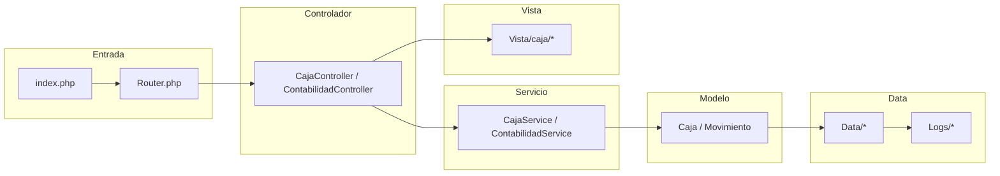

# Módulo: Caja / Contabilidad

Este documento describe el análisis del módulo **Caja/Contabilidad** en el proyecto `parroquiaPOO`, incluyendo arquitectura MVC específica, fortalezas, falencias, oportunidades de mejora y un diagrama Mermaid del flujo.

---

## 1) Resumen del módulo

El módulo **Caja/Contabilidad** gestiona:
- Registro de ingresos y egresos.
- Arqueos de caja y conciliaciones.
- Reportes contables y financieros.
- Integración con Donaciones y otros módulos relacionados.

### Archivos esperados en la estructura MVC:
- **Controlador**: `Controlador/CajaController.php` o `ContabilidadController.php`
- **Servicio**: `Servicios/CajaService.php` o `ContabilidadService.php`
- **Modelo**: `Modelo/Caja.php` o `Modelo/Movimiento.php`
- **Vista**: `Vista/caja/*` o `Vista/contabilidad/*`
- **Data**: `Data/*` (persistencia), `Logs/*` (auditoría)

---

## 2) Fortalezas
- Arquitectura MVC clara (Controlador, Servicio, Modelo, Vista).
- Uso de `phpstan` para análisis estático.
- Presencia de pruebas (`tests`) y configuración (`codeception.yml`).

## 3) Falencias detectadas
- Posible falta de validación en montos y conciliaciones.
- Ausencia de repositorios para desacoplar persistencia.
- Falta de documentación en `README.md`.
- Posible mezcla de lógica en Controlador.

## 4) Oportunidades de optimización
- Implementar validaciones robustas para montos y conciliaciones.
- Centralizar lógica en Servicios.
- Añadir pruebas unitarias para cálculos contables.
- Mejorar separación de responsabilidades.

---

## 5) Diagrama Mermaid — Flujo MVC del módulo

---

## 6) Checklist de mejoras

- [ ] Validar datos y sanitizar entradas en Controlador y Servicio.
- [ ] Implementar repositorios para desacoplar Modelo y Data.
- [ ] Añadir pruebas unitarias para CajaService.
- [ ] Documentar flujos en `README.md` y enlazar este archivo.
- [ ] Configurar CI/CD para ejecutar `phpstan` y `codeception`.

---

## 7) Seguridad y buenas prácticas

- Asegurar que `.env` esté en `.gitignore`.
- Bloquear acceso directo a `Vista/*` y `Data/*` mediante `.htaccess`.
- Usar consultas preparadas para evitar SQL Injection.
- Validar y escapar datos en vistas para prevenir XSS.

