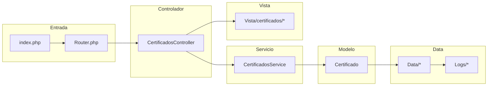

# Módulo: Certificados

Este documento describe el análisis del módulo **Certificados** en el proyecto `parroquiaPOO`, incluyendo arquitectura MVC específica, fortalezas, falencias, oportunidades de mejora y un diagrama Mermaid del flujo.

---

## 1) Resumen del módulo

El módulo **Certificados** gestiona:
- Emisión de certificados sacramentales (bautismo, confirmación, matrimonio, etc.).
- Validación de datos y requisitos previos.
- Generación de documentos imprimibles o descargables.
- Registro de solicitudes y control de auditoría.

### Archivos esperados en la estructura MVC:
- **Controlador**: `Controlador/CertificadosController.php`
- **Servicio**: `Servicios/CertificadosService.php`
- **Modelo**: `Modelo/Certificado.php`
- **Vista**: `Vista/certificados/*` (formularios, plantillas)
- **Data**: `Data/*` (persistencia), `Logs/*` (auditoría)

---

## 2) Fortalezas
- Arquitectura MVC clara (Controlador, Servicio, Modelo, Vista).
- Uso de `phpstan` para análisis estático.
- Presencia de pruebas (`tests`) y configuración (`codeception.yml`).

## 3) Falencias detectadas
- Posible falta de separación entre lógica de negocio y generación de documentos.
- Validación insuficiente en datos (riesgo XSS/SQL Injection).
- Ausencia de plantillas parametrizables para certificados.
- Falta de documentación en `README.md`.

## 4) Oportunidades de optimización
- Implementar plantillas dinámicas para certificados.
- Centralizar validaciones en Servicios.
- Añadir pruebas unitarias para lógica de generación y validación.
- Mejorar separación de responsabilidades (Controlador delgado, lógica en Servicio).

---

## 5) Diagrama Mermaid — Flujo MVC del módulo

---

## 6) Checklist de mejoras

- [ ] Validar datos y sanitizar entradas en Controlador y Servicio.
- [ ] Implementar plantillas dinámicas para certificados.
- [ ] Añadir pruebas unitarias para CertificadosService.
- [ ] Documentar flujos en `README.md` y enlazar este archivo.
- [ ] Configurar CI/CD para ejecutar `phpstan` y `codeception`.

---

## 7) Seguridad y buenas prácticas

- Asegurar que `.env` esté en `.gitignore`.
- Bloquear acceso directo a `Vista/*` y `Data/*` mediante `.htaccess`.
- Usar consultas preparadas para evitar SQL Injection.
- Validar y escapar datos en vistas para prevenir XSS.

