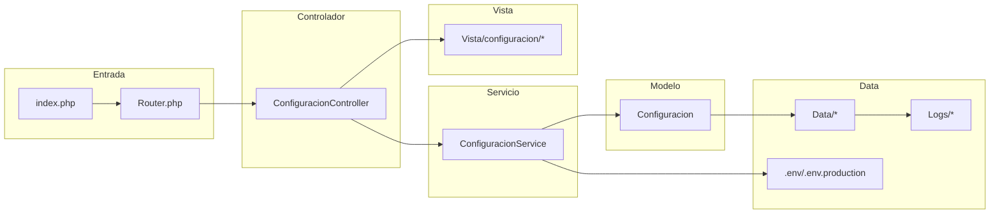

# Módulo: Configuración

Este documento describe el análisis del módulo **Configuración** en el proyecto `parroquiaPOO`, incluyendo arquitectura MVC específica, fortalezas, falencias, oportunidades de mejora y un diagrama Mermaid del flujo.

---

## 1) Resumen del módulo

El módulo **Configuración** gestiona:
- Parámetros generales de la parroquia (nombre, dirección, contacto, horarios).
- Plantillas de certificados y formatos de impresión.
- Numeraciones y prefijos (actas, recibos, comprobantes).
- Reglas operativas (requisitos de sacramentos, políticas de agenda y reservas).
- Integraciones externas (correo, mensajería, pasarela de pago — si aplica).

### Archivos esperados en la estructura MVC:
- **Controlador**: `Controlador/ConfiguracionController.php`
- **Servicio**: `Servicios/ConfiguracionService.php`
- **Modelo**: `Modelo/Configuracion.php`
- **Vista**: `Vista/configuracion/*`
- **Data**: `Data/*` (persistencia), `Logs/*` (auditoría)

---

## 2) Fortalezas
- Arquitectura MVC clara (Controlador, Servicio, Modelo, Vista).
- Uso de `phpstan` para análisis estático.
- Presencia de pruebas (`tests`) y configuración (`codeception.yml`).

## 3) Falencias detectadas
- Posible mezcla de configuración estática y dinámica sin capas claras.
- Riesgo de parámetros sensibles mal gestionados (ej.: claves API en `.env`).
- Falta de documentación de cada parámetro y su impacto.
- Ausencia de versionado/rollback de cambios de configuración.

## 4) Oportunidades de optimización
- Implementar un **repositorio de configuración** con caché (ej.: cargar desde `Data` y cachear en memoria).
- Separar **config estática** (en archivos) de **config dinámica** (en base de datos).
- Añadir historial y auditoría de cambios (quién, cuándo, qué).
- Validar y tipar parámetros (enteros, booleanos, listas, expresiones regulares).

---

## 5) Diagrama Mermaid — Flujo MVC del módulo

---

## 6) Checklist de mejoras

- [ ] Documentar todos los parámetros (fuente, rango válido, efecto en el sistema).
- [ ] Centralizar lectura/escritura de configuración en `ConfiguracionService` y repositorio.
- [ ] Añadir auditoría y rollback de cambios.
- [ ] Validar tipos y rangos antes de persistir.
- [ ] Proteger claves y secretos en `.env`; nunca exponer en vistas.
- [ ] Añadir pruebas unitarias para reglas y validaciones.
- [ ] Integrar CI para verificar esquemas y defaults de configuración.

---

## 7) Seguridad y buenas prácticas

- Mantener `.env` fuera del control de versiones (`.gitignore`).
- En vistas, nunca mostrar valores sensibles (claves, tokens).
- Minimizar superficie de ataque con `.htaccess` bloqueando acceso a `Data` y `.env`.
- Registrar cambios de configuración con usuario, timestamp y dif.

