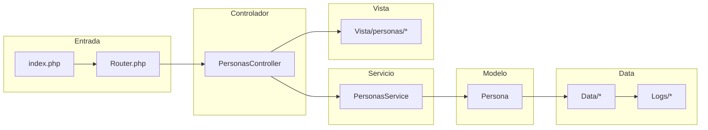

# Módulo: Personas / Feligreses

Este documento describe el análisis del módulo **Personas/Feligreses** en el proyecto `parroquiaPOO`, incluyendo arquitectura MVC específica, fortalezas, falencias, oportunidades de mejora y un diagrama Mermaid del flujo.

---

## 1) Resumen del módulo

El módulo **Personas/Feligreses** gestiona:
- Registro y actualización de datos personales.
- Historial sacramental.
- Emisión de certificados.
- Búsqueda y filtrado de feligreses.

### Archivos esperados en la estructura MVC:
- **Controlador**: `Controlador/PersonasController.php`
- **Servicio**: `Servicios/PersonasService.php`
- **Modelo**: `Modelo/Persona.php` o `Modelo/Feligres.php`
- **Vista**: `Vista/personas/*` (formularios, listados)
- **Data**: `Data/*` (persistencia), `Logs/*` (auditoría)

---

## 2) Fortalezas
- Arquitectura MVC clara (Controlador, Servicio, Modelo, Vista).
- Uso de `phpstan` para análisis estático (buena práctica).
- Presencia de `tests` y `codeception.yml` para pruebas automatizadas.

## 3) Falencias detectadas
- Posible acoplamiento entre Controlador y Data (si no se usa Servicio como intermediario).
- Validación insuficiente en entradas (riesgo XSS/SQL Injection).
- Falta de documentación en `README.md`.
- Ausencia de interfaces para repositorios (dificulta escalabilidad).

## 4) Oportunidades de optimización
- Implementar **repositorios** para desacoplar persistencia.
- Centralizar validaciones en Servicios o clases dedicadas.
- Añadir pruebas unitarias específicas para lógica de negocio.
- Mejorar separación de responsabilidades (Controlador delgado, lógica en Servicio).

---

## 5) Diagrama Mermaid — Flujo MVC del módulo

---

## 6) Checklist de mejoras

- [ ] Revisar sanitización y validación de datos en Controlador y Servicio.
- [ ] Implementar repositorios para desacoplar Modelo y Data.
- [ ] Añadir pruebas unitarias para PersonasService.
- [ ] Documentar flujos en `README.md` y enlazar este archivo.
- [ ] Configurar CI/CD para ejecutar `phpstan` y `codeception`.

---

## 7) Seguridad y buenas prácticas

- Asegurar que `.env` esté en `.gitignore`.
- Bloquear acceso directo a `Vista/*` y `Data/*` mediante `.htaccess`.
- Usar consultas preparadas para evitar SQL Injection.
- Validar y escapar datos en vistas para prevenir XSS.

