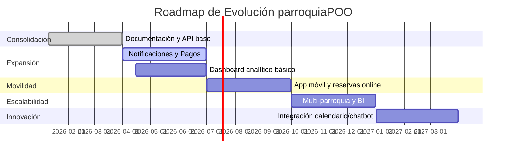
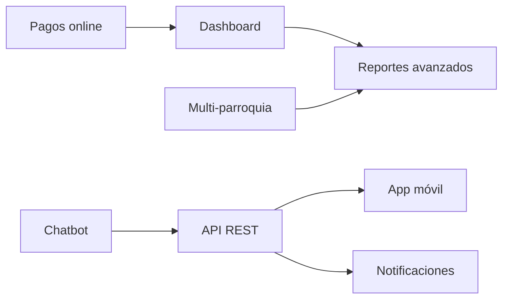

# Roadmap de Evolución — Proyecto parroquiaPOO

Este documento describe un plan estratégico para la **evolución del sistema parroquiaPOO**, enfocado en agregar nuevos módulos y funcionalidades (no reparación de errores), con el objetivo de escalar y mejorar la experiencia del usuario.

---

## 1) Visión General

El sistema parroquiaPOO evolucionará hacia una plataforma integral para la gestión parroquial, con capacidades móviles, analíticas y multi-parroquia, manteniendo la arquitectura modular y escalable.

---

## 2) Fases del Roadmap

### **Fase 1 — Consolidación (0-3 meses)**
- Integrar módulos actuales en un flujo homogéneo.
- Mejorar documentación y guías de uso.
- Preparar base para API REST.

### **Fase 2 — Expansión (3-6 meses)**
- **Nuevo módulo: Notificaciones** (email, SMS, WhatsApp).
- **Integración con pasarela de pagos** (donaciones online).
- **Dashboard analítico básico** (gráficos de sacramentos, aportes).

### **Fase 3 — Movilidad (6-9 meses)**
- **App móvil** (Android/iOS) conectada vía API.
- **Módulo de reservas online** (salones, recursos).

### **Fase 4 — Escalabilidad (9-12 meses)**
- **Multi-parroquia** (gestión de varias parroquias en una instancia).
- **Reportes avanzados y BI** (Power BI, exportaciones automáticas).

### **Fase 5 — Innovación (12+ meses)**
- **Integración con calendario externo** (Google Calendar, Outlook).
- **Chatbot parroquial** (consultas rápidas, agenda).

---

## 3) Nuevos módulos propuestos
- **Notificaciones**: envío masivo y segmentado.
- **Pagos online**: integración con Stripe, PayPal.
- **App móvil**: acceso a sacramentos, agenda, donaciones.
- **API REST**: interoperabilidad con apps externas.
- **Dashboard analítico**: métricas clave y gráficos.
- **Multi-parroquia**: administración centralizada.
- **Chatbot**: atención automatizada.

---

## 4) Diagramas Mermaid

### Roadmap temporal

### Dependencias entre módulos

---

## 5) Recomendaciones tecnológicas
- **Backend**: Mantener PHP con MVC, considerar migración parcial a Laravel para API.
- **Frontend**: Mejorar UX con componentes dinámicos (Vue.js o React).
- **Móvil**: Flutter o React Native para desarrollo multiplataforma.
- **Base de datos**: Optimizar consultas, considerar PostgreSQL para escalabilidad.
- **Infraestructura**: Contenedores (Docker), CI/CD con GitHub Actions.
- **Seguridad**: OAuth2 para API, cifrado avanzado para datos sensibles.

