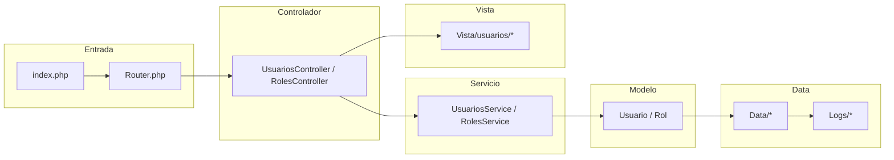

# Módulo: Usuarios / Roles

Este documento describe el análisis del módulo **Usuarios/Roles** en el proyecto `parroquiaPOO`, incluyendo arquitectura MVC específica, fortalezas, falencias, oportunidades de mejora y un diagrama Mermaid del flujo.

---

## 1) Resumen del módulo

El módulo **Usuarios/Roles** gestiona:
- Registro y administración de usuarios.
- Asignación de roles y permisos.
- Integración con autenticación y otros módulos.

### Archivos esperados en la estructura MVC:
- **Controlador**: `Controlador/UsuariosController.php` o `RolesController.php`
- **Servicio**: `Servicios/UsuariosService.php` o `RolesService.php`
- **Modelo**: `Modelo/Usuario.php` o `Modelo/Rol.php`
- **Vista**: `Vista/usuarios/*`
- **Data**: `Data/*` (persistencia), `Logs/*` (auditoría)

---

## 2) Fortalezas
- Arquitectura MVC clara (Controlador, Servicio, Modelo, Vista).
- Uso de `phpstan` para análisis estático.
- Presencia de pruebas (`tests`) y configuración (`codeception.yml`).

## 3) Falencias detectadas
- Posible falta de validación en asignación de roles y credenciales.
- Ausencia de repositorios para desacoplar persistencia.
- Falta de documentación en `README.md`.
- Posible mezcla de lógica en Controlador.

## 4) Oportunidades de optimización
- Implementar validaciones robustas para credenciales y roles.
- Centralizar lógica en Servicios.
- Añadir pruebas unitarias para casos de autenticación y autorización.
- Mejorar separación de responsabilidades.

---

## 5) Diagrama Mermaid — Flujo MVC del módulo

---

## 6) Checklist de mejoras

- [ ] Validar datos y sanitizar entradas en Controlador y Servicio.
- [ ] Implementar repositorios para desacoplar Modelo y Data.
- [ ] Añadir pruebas unitarias para UsuariosService.
- [ ] Documentar flujos en `README.md` y enlazar este archivo.
- [ ] Configurar CI/CD para ejecutar `phpstan` y `codeception`.

---

## 7) Seguridad y buenas prácticas

- Asegurar que `.env` esté en `.gitignore`.
- Bloquear acceso directo a `Vista/*` y `Data/*` mediante `.htaccess`.
- Usar consultas preparadas para evitar SQL Injection.
- Validar y escapar datos en vistas para prevenir XSS.
- Implementar cifrado seguro para contraseñas (bcrypt o Argon2).

