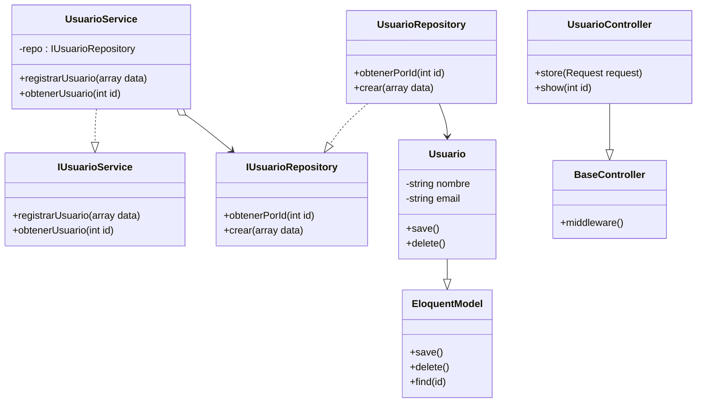

# Arquitectura: Controlador, Servicio, Repositorio y Modelo

Este documento explica la diferencia entre **Controlador**, **Servicio**, **Repositorio** y **Modelo**, junto con sus responsabilidades y relaciones en una arquitectura típica (ej. Laravel, Spring, NestJS).

---

## ✅ Roles y responsabilidades

### **Controlador**
- Actúa como **intermediario** entre la capa de presentación (HTTP/API) y la lógica de negocio.
- Recibe peticiones, valida datos y delega la lógica al servicio.
- No debe contener lógica compleja ni acceder directamente a la base de datos.

### **Servicio**
- Encapsula la **lógica de negocio** y las reglas del dominio.
- Orquesta procesos, validaciones y llamadas a repositorios.
- No maneja detalles de interfaz (HTTP, JSON).

### **Repositorio**
- Encapsula la lógica de **acceso a datos**.
- Opera sobre los modelos para consultar, guardar y eliminar.
- Permite desacoplar la persistencia del resto de la aplicación.

### **Modelo**
- Representa la estructura de datos (entidad) y sus relaciones.
- En frameworks como Laravel, mapea directamente a una tabla en la base de datos.

---

## ✅ Flujo típico
```
HTTP Request → Controlador → Servicio → Repositorio → Modelo → Base de Datos
```

---

## ✅ Diagrama UML (Mermaid)


---

## ✅ Buenas prácticas
- Mantener **controladores delgados**: solo delegan.
- Servicios deben contener **lógica de negocio**, no SQL.
- Repositorios deben manejar **persistencia**, no reglas.
- Modelos solo representan datos y relaciones.

---

¿Quieres ver ejemplos en código? Consulta la sección anterior donde mostramos implementaciones simples en Laravel.
